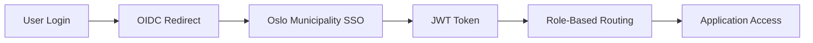

# oslo-kindergarten-vue

This template should help get you started developing with Vue 3 in Vite.

## Recommended IDE Setup

[VSCode](https://code.visualstudio.com/) + [Volar](https://marketplace.visualstudio.com/items?itemName=Vue.volar) (and disable Vetur).

## Type Support for `.vue` Imports in TS

TypeScript cannot handle type information for `.vue` imports by default, so we replace the `tsc` CLI with `vue-tsc` for type checking. In editors, we need [Volar](https://marketplace.visualstudio.com/items?itemName=Vue.volar) to make the TypeScript language service aware of `.vue` types.

## Customize configuration

See [Vite Configuration Reference](https://vite.dev/config/).

## Project Setup

```sh
npm install# Oslo Kindergarten Management System - Frontend

> A comprehensive Vue 3 application for managing kindergarten admissions and placements in Oslo Municipality

[](https://vuejs.org/)
[](https://www.typescriptlang.org/)
[](https://vitejs.dev/)
[](https://tailwindcss.com/)

## 📋 Table of Contents

- [Overview](#overview)
- [Quick Start](#quick-start)
- [Development Status](#development-status)
- [Project Structure](#project-structure)
- [Development Setup](#development-setup)
- [Working with Cursor AI](#working-with-cursor-ai)
- [Key Concepts](#key-concepts)
- [Available Scripts](#available-scripts)
- [Testing](#testing)
- [Deployment](#deployment)
- [Contributing](#contributing)

## 📖 Overview

This frontend application serves multiple user roles in the Oslo kindergarten system:

- **👨‍👩‍👧‍👦 Guardians**: Submit applications, track placement status, manage child information
- **👩‍💼 Case Managers**: Process applications, manage waiting lists, create offers
- **🏫 Kindergarten Staff**: Manage capacity, track attendance, communicate with families
- **⚙️ System Administrators**: User management, system configuration, reporting

### Key Features
- 🔐 **Role-based access control** with Oslo Municipality SSO integration
- 📱 **Responsive design** optimized for desktop and mobile
- ♿ **WCAG 2.2 AA compliant** for accessibility
- 🌍 **Multi-language support** (Norwegian primary, English fallback)
- ⚡ **Real-time updates** via WebSocket connections
- 📊 **Advanced data filtering** and bulk operations

---

## 🚀 Quick Start

### Prerequisites

- **Node.js** 18+ and **npm** 9+
- **Git** for version control
- **Cursor AI** or VS Code with Vue/TypeScript extensions

### Installation

```bash
# Clone the repository
git clone https://github.com/oslo-kommune/kindergarten-frontend.git
cd IST-CHILDCARE/frontend

# Install dependencies
npm install

# Copy environment configuration
cp .env.example .env.local

# Start development server
npm run dev
```

🎉 Open [http://localhost:5173](http://localhost:5173) to view the application!

---

## 📊 Development Status

**Overall Progress: 65%** - Foundation architecture completed, ready for AI-assisted development

### ✅ Completed Components (Ready for AI Development)

#### 1. **TypeScript Foundation (100%)**
- ✅ Complete type definitions for all domain objects
- ✅ `src/types/common.ts` - Core API and utility types
- ✅ `src/types/user.ts` - User roles, authentication, profiles
- ✅ `src/types/application.ts` - Application workflows and data
- ✅ `src/types/kindergarten.ts` - Kindergarten management types

#### 2. **State Management (Pinia) (80%)**
- ✅ `src/stores/auth.ts` - Authentication state management
- ✅ `src/stores/ui.ts` - Global UI state (loading, notifications, themes)
- ✅ `src/stores/applications.ts` - Application CRUD operations
- ✅ `src/stores/kindergartens.ts` - Kindergarten data management

#### 3. **Composables Layer (70%)**
- ✅ `src/composables/auth/useAuth.ts` - Authentication integration
- ✅ `src/composables/auth/usePermissions.ts` - Role-based access control
- ✅ `src/composables/api/useApplications.ts` - Application API operations
- ✅ `src/composables/ui/useModal.ts` - Modal management system

#### 4. **Base UI Components (60%)**
- ✅ `src/components/base/BaseButton.vue` - Oslo design system button
- ✅ `src/components/base/BaseModal.vue` - Accessible modal component
- ✅ Full accessibility compliance (WCAG 2.2 AA)
- ✅ Oslo Municipality design tokens integrated

#### 5. **API Service Layer (50%)**
- ✅ `src/services/api/base.ts` - HTTP client with interceptors
- ✅ Error handling and response transformation
- ✅ Authentication token management
- ✅ File upload/download utilities

#### 6. **Project Configuration (100%)**
- ✅ All required dependencies defined
- ✅ Build configuration with path aliases
- ✅ Strict TypeScript configuration
- ✅ Oslo design system integration
- ✅ ESLint, Prettier configuration
- ✅ Environment variable setup

#### 7. **Static Assets & PWA (100%)**
- ✅ `public/manifest.json` - Progressive Web App configuration
- ✅ `public/robots.txt` - Search engine instructions (security-focused)
- ✅ `public/favicon.ico` - Browser tab icon placeholder
- ✅ Complete PWA setup with Oslo Municipality branding guidelines

### 🚧 Missing Components (AI Development Targets)

#### **Priority: High - Core Business Logic**
```typescript
// Missing composables:
src/composables/api/
├── useOffers.ts           // Offer management operations
├── useWaitingList.ts      // Waiting list operations  
├── useKindergartens.ts    // Kindergarten data access
└── useUsers.ts            // User management

// Missing base components:
src/components/base/
├── BaseInput.vue          // Form input component
├── BaseSelect.vue         // Dropdown select component
├── BaseTable.vue          // Data table component
├── BaseCard.vue           // Content card component
└── BaseAlert.vue          // Alert/notification component

// Missing form components:
src/components/forms/
├── ApplicationForm.vue    // Main kindergarten application form
├── OfferForm.vue          // Placement offer form
└── FormField.vue          // Generic form field wrapper
```

#### **Priority: Medium - User Interface**
```vue
// Missing data components:
src/components/data/
├── ApplicationList.vue    // Applications listing with filters
├── WaitingList.vue        // Waiting list display
├── CapacityOverview.vue   // Kindergarten capacity view
└── DashboardMetrics.vue   // KPI dashboard widgets

// Missing navigation:
src/components/navigation/
├── AppNavbar.vue          // Main navigation bar
├── Sidebar.vue            // Role-based sidebar menu
└── Breadcrumb.vue         // Breadcrumb navigation
```

#### **Priority: High - Page Components**
```vue
src/pages/
├── auth/ - Authentication pages
├── guardian/ - Guardian user interfaces  
├── case-manager/ - Case manager workflows
├── kindergarten/ - Kindergarten staff tools
└── admin/ - System administration
```

---

## 📁 Project Structure

```
kindergarten-app/
├── 📄 README.md                    # This comprehensive guide
├── 📄 package.json                 # Dependencies and scripts
├── 📄 vite.config.js               # Vite build configuration
├── 📄 tsconfig.json                # TypeScript configuration
├── 📄 tailwind.config.js           # Tailwind CSS configuration
├── 📄 .eslintrc.js                 # ESLint code quality rules
├── 📄 .prettierrc                  # Code formatting rules
├── 📄 .env.example                 # Environment variables template
├── 📄 .gitignore                   # Git ignore patterns
├── 📄 Dockerfile                   # Container configuration
├── 📄 nginx.conf                   # Production web server config
│
├── 📂 public/                      # Static assets (served directly)
│   ├── favicon.ico                 # Browser tab icon
│   ├── manifest.json               # PWA configuration
│   └── robots.txt                  # Search engine instructions
│
├── 📂 src/                         # Main application source code
│   ├── 📄 main.js                  # Application entry point
│   ├── 📄 App.vue                  # Root Vue component
│   │
│   ├── 📂 assets/                  # Static assets requiring processing
│   │   ├── 📂 images/              # Images, icons, illustrations
│   │   └── 📂 styles/              # Global stylesheets
│   │       ├── main.scss           # Main stylesheet imports
│   │       ├── variables.scss      # Oslo design system tokens
│   │       └── components.scss     # Global component styles
│   │
│   ├── 📂 components/              # Reusable Vue components
│   │   ├── 📂 base/                # Foundation UI components
│   │   │   ├── BaseButton.vue      # ✅ Oslo design system button
│   │   │   ├── BaseInput.vue       # 🚧 Form input component
│   │   │   ├── BaseModal.vue       # ✅ Modal dialog component
│   │   │   ├── BaseTable.vue       # 🚧 Data table component
│   │   │   └── BaseCard.vue        # 🚧 Content card component
│   │   │
│   │   ├── 📂 forms/               # Form-specific components
│   │   │   ├── ApplicationForm.vue # 🚧 Kindergarten application form
│   │   │   ├── OfferForm.vue       # 🚧 Placement offer form
│   │   │   └── FormField.vue       # 🚧 Generic form field wrapper
│   │   │
│   │   ├── 📂 data/                # Data display components
│   │   │   ├── ApplicationList.vue # 🚧 Applications listing
│   │   │   ├── WaitingList.vue     # 🚧 Waiting list display
│   │   │   ├── CapacityOverview.vue# 🚧 Kindergarten capacity view
│   │   │   └── DashboardMetrics.vue# 🚧 KPI dashboard widgets
│   │   │
│   │   ├── 📂 navigation/          # Navigation components
│   │   │   ├── AppNavbar.vue       # 🚧 Main navigation bar
│   │   │   ├── Sidebar.vue         # 🚧 Role-based sidebar menu
│   │   │   ├── Breadcrumb.vue      # 🚧 Breadcrumb navigation
│   │   │   └── UserMenu.vue        # 🚧 User profile dropdown
│   │   │
│   │   └── 📂 communication/       # Communication features
│   │       ├── MessageCenter.vue   # 🚧 Internal messaging
│   │       ├── NotificationToast.vue# 🚧 Toast notifications
│   │       └── ChatWidget.vue      # 🚧 Real-time chat
│   │
│   ├── 📂 composables/             # Vue 3 Composition API logic
│   │   ├── 📂 auth/                # Authentication composables
│   │   │   ├── useAuth.js          # ✅ Authentication state & methods
│   │   │   ├── usePermissions.js   # ✅ Role-based permission checks
│   │   │   └── useOidc.js          # 🚧 OIDC integration logic
│   │   │
│   │   ├── 📂 api/                 # API interaction composables
│   │   │   ├── useApplications.js  # ✅ Application CRUD operations
│   │   │   ├── useOffers.js        # 🚧 Offer management logic
│   │   │   ├── useWaitingList.js   # 🚧 Waiting list operations
│   │   │   └── useKindergartens.js # 🚧 Kindergarten data access
│   │   │
│   │   ├── 📂 ui/                  # UI state composables
│   │   │   ├── useModal.js         # ✅ Modal state management
│   │   │   ├── useNotifications.js # 🚧 Toast notification system
│   │   │   ├── useFilters.js       # 🚧 Data filtering logic
│   │   │   └── usePagination.js    # 🚧 Pagination utilities
│   │   │
│   │   └── 📂 utils/               # Utility composables
│   │       ├── useLocalStorage.js  # 🚧 Local storage wrapper
│   │       ├── useDebounce.js      # 🚧 Input debouncing
│   │       └── useFileUpload.js    # 🚧 File upload handling
│   │
│   ├── 📂 layouts/                 # Page layout templates
│   │   ├── DefaultLayout.vue       # ✅ Standard application layout
│   │   ├── AuthLayout.vue          # ✅ Authentication pages layout
│   │   ├── DashboardLayout.vue     # ✅ Dashboard with sidebar
│   │   └── PrintLayout.vue         # 🚧 Print-optimized layout
│   │
│   ├── 📂 pages/                   # Route components (views)
│   │   ├── 📂 auth/                # Authentication pages
│   │   │   ├── LoginPage.vue       # 🚧 Login/OIDC redirect
│   │   │   └── CallbackPage.vue    # 🚧 OIDC callback handler
│   │   │
│   │   ├── 📂 guardian/            # Guardian-specific pages
│   │   │   ├── DashboardPage.vue   # 🚧 Guardian overview
│   │   │   ├── ApplicationPage.vue # 🚧 Submit/edit applications
│   │   │   ├── PlacementPage.vue   # 🚧 View placement status
│   │   │   └── ProfilePage.vue     # 🚧 Manage family information
│   │   │
│   │   ├── 📂 case-manager/        # Case manager pages
│   │   │   ├── DashboardPage.vue   # 🚧 Case manager overview
│   │   │   ├── ApplicationsPage.vue# 🚧 Review applications
│   │   │   ├── WaitingListPage.vue # 🚧 Manage waiting lists
│   │   │   ├── OffersPage.vue      # 🚧 Create/manage offers
│   │   │   └── ReportsPage.vue     # 🚧 Generate reports
│   │   │
│   │   ├── 📂 kindergarten/        # Kindergarten staff pages
│   │   │   ├── DashboardPage.vue   # 🚧 Kindergarten overview
│   │   │   ├── CapacityPage.vue    # 🚧 Manage capacity
│   │   │   ├── AttendancePage.vue  # 🚧 Track attendance
│   │   │   └── CommunicationPage.vue# 🚧 Family communication
│   │   │
│   │   ├── 📂 admin/               # System admin pages
│   │   │   ├── DashboardPage.vue   # 🚧 System overview
│   │   │   ├── UserManagementPage.vue# 🚧 Manage users
│   │   │   ├── RoleManagementPage.vue# 🚧 Configure roles
│   │   │   └── SystemConfigPage.vue# 🚧 System settings
│   │   │
│   │   └── 📂 shared/              # Shared pages
│   │       ├── NotFoundPage.vue    # 🚧 404 error page
│   │       └── UnauthorizedPage.vue# 🚧 403 access denied
│   │
│   ├── 📂 plugins/                 # Vue plugins and configurations
│   │   ├── router.js               # ✅ Vue Router setup
│   │   ├── pinia.js                # ✅ Pinia store configuration
│   │   ├── i18n.js                 # ✅ Internationalization setup
│   │   └── axios.js                # 🚧 HTTP client configuration
│   │
│   ├── 📂 services/                # External service integrations
│   │   ├── 📂 api/                 # REST API services
│   │   │   ├── base.js             # ✅ Base HTTP client
│   │   │   ├── auth.js             # 🚧 Authentication API
│   │   │   ├── applications.js     # 🚧 Application endpoints
│   │   │   ├── offers.js           # 🚧 Offer endpoints
│   │   │   ├── kindergartens.js    # 🚧 Kindergarten endpoints
│   │   │   ├── users.js            # 🚧 User management API
│   │   │   └── reports.js          # 🚧 Reporting API
│   │   │
│   │   ├── 📂 websocket/           # Real-time communication
│   │   │   ├── connection.js       # 🚧 WebSocket connection manager
│   │   │   └── eventHandlers.js    # 🚧 WebSocket event handlers
│   │   │
│   │   └── 📂 utils/               # Service utilities
│   │       ├── errorHandler.js     # 🚧 Global error handling
│   │       ├── validator.js        # 🚧 Data validation utilities
│   │       └── formatter.js        # 🚧 Data formatting helpers
│   │
│   ├── 📂 stores/                  # Pinia state management
│   │   ├── auth.js                 # ✅ Authentication state
│   │   ├── user.js                 # 🚧 User profile & preferences
│   │   ├── applications.js         # ✅ Application state
│   │   ├── offers.js               # 🚧 Offer management state
│   │   ├── kindergartens.js        # ✅ Kindergarten data
│   │   ├── notifications.js        # 🚧 Notification state
│   │   └── ui.js                   # ✅ UI state (modals, loading)
│   │
│   ├── 📂 types/                   # TypeScript type definitions
│   │   ├── api.ts                  # 🚧 API response types
│   │   ├── user.ts                 # ✅ User and role types
│   │   ├── application.ts          # ✅ Application data types
│   │   ├── kindergarten.ts         # ✅ Kindergarten types
│   │   └── common.ts               # ✅ Shared utility types
│   │
│   ├── 📂 utils/                   # Utility functions
│   │   ├── constants.js            # 🚧 Application constants
│   │   ├── permissions.js          # 🚧 Permission checking utilities
│   │   ├── validators.js           # 🚧 Form validation rules
│   │   ├── formatters.js           # 🚧 Data formatting functions
│   │   └── helpers.js              # 🚧 General helper functions
│   │
│   ├── 📂 router/                  # Router configuration
│   │   ├── index.js                # ✅ Main router setup
│   │   ├── guards.js               # ✅ Route guard definitions
│   │   └── 📂 routes/              # Route definitions by module
│   │       ├── auth.js             # ✅ Authentication routes
│   │       ├── guardian.js         # ✅ Guardian routes
│   │       ├── caseManager.js      # ✅ Case manager routes
│   │       ├── kindergarten.js     # ✅ Kindergarten routes
│   │       └── admin.js            # ✅ Admin routes
│   │
│   └── 📂 locales/                 # Internationalization files
│       ├── no.json                 # ✅ Norwegian translations (primary)
│       └── en.json                 # ✅ English translations (fallback)
│
├── 📂 tests/                       # Test suites
│   ├── 📂 unit/                    # Unit tests for components/composables
│   ├── 📂 integration/             # Integration tests for workflows
│   ├── 📂 e2e/                     # End-to-end tests with Cypress
│   └── 📂 utils/                   # Testing utilities and helpers
│
└── 📂 docs/                        # Project documentation
    ├── development.md              # Development guidelines
    ├── deployment.md               # Deployment instructions
    ├── component-library.md        # Component usage guide
    └── api-integration.md          # API integration guide
```

**Legend:**
- ✅ **Complete** - Ready for production
- 🚧 **Missing** - Target for AI development

---

## 🛠️ Development Setup

### Environment Variables

Create `.env.local` from the template and configure:

```bash
# API Configuration
VITE_API_BASE_URL=http://localhost:8080/api
VITE_WS_URL=ws://localhost:8080/ws

# Authentication (Oslo Municipality OIDC)
VITE_OIDC_AUTHORITY=https://login.oslo.kommune.no
VITE_OIDC_CLIENT_ID=kindergarten-frontend-dev
VITE_OIDC_REDIRECT_URI=http://localhost:5173/auth/callback

# Feature Flags
VITE_ENABLE_REAL_TIME=true
VITE_ENABLE_ANALYTICS=false

# Development Settings
VITE_LOG_LEVEL=debug
VITE_MOCK_API=false
```

### IDE Setup (Cursor AI)

**Recommended Cursor AI Settings:**

1. **Enable TypeScript**: Cursor will provide better autocomplete and error detection
2. **Install Vue Language Features**: Ensures proper Vue 3 Composition API support
3. **Configure AI Context**: Add these patterns to your `.cursorignore`:
   ```
   node_modules/
   dist/
   coverage/
   *.log
   .env.local
   ```

**Essential Cursor AI Prompts for this project:**

```
# Component Creation
"Create a new Vue 3 component for [functionality] following the project's BaseComponent pattern with TypeScript, accessibility, and Oslo design system"

# API Integration
"Add API integration for [endpoint] using the existing composables pattern and error handling"

# Testing
"Generate unit tests for this component following the project's testing conventions with Vitest"

# Accessibility
"Review this component for WCAG 2.2 AA compliance and suggest improvements"
```

---

## 🧠 Working with Cursor AI

### Project Context for AI

When working with Cursor AI, provide this context for better assistance:

1. **Architecture**: "This is a Vue 3 Composition API project with TypeScript, Pinia for state management, and role-based access control"

2. **Domain**: "Oslo Municipality kindergarten admission system with Guardian, Case Manager, Kindergarten Staff, and Admin roles"

3. **Patterns**: "Follow the established patterns in composables/, use TypeScript interfaces from types/, and ensure WCAG 2.2 AA compliance"

### AI Development Strategy

#### **Base Components Development**
**AI Prompt Example:**
```
"Create BaseInput.vue component following the Oslo Municipality design system patterns established in BaseButton.vue. Include full TypeScript support, accessibility (WCAG 2.2 AA), validation states (error, warning, success), and integration with Vue 3 Composition API. Support all HTML input types and custom validation."
```

#### **Form System Development**
**AI Prompt Example:**
```
"Create ApplicationForm.vue component using the established base components and TypeScript types. Implement multi-step form with kindergarten preferences, priority codes, document upload, and validation. Use the useApplications composable for data management and follow the Oslo design patterns."
```

#### **Data Display Components**
**AI Prompt Example:**
```
"Create ApplicationList.vue component with filtering, pagination, and sorting. Use the existing BaseTable.vue component and implement role-based data access. Include export functionality and bulk operations following the Oslo design system."
```

#### **Page Components & Navigation**
**AI Prompt Example:**
```
"Create Guardian dashboard page with application overview, status tracking, and quick actions. Implement responsive design following Oslo Municipality accessibility guidelines. Use existing composables for data management and state synchronization."
```

### Common AI Prompts

```bash
# Component Development
"Create a [ComponentName] component that follows our base component pattern with props validation and accessibility"

# API Integration
"Add API integration for [feature] using our existing useApi composable pattern"

# State Management
"Create a Pinia store for [domain] following our established store pattern"

# Testing
"Generate comprehensive tests for this component including edge cases and accessibility"

# Refactoring
"Refactor this component to use Composition API and improve TypeScript typing"
```

---

## 🔑 Key Concepts

### Authentication Flow


### Component Hierarchy
```
App.vue
├── Router-View (Dynamic Layout)
│   ├── DefaultLayout.vue
│   │   ├── AppNavbar.vue
│   │   ├── Sidebar.vue (Role-based)
│   │   └── Page Components
│   └── AuthLayout.vue
│       └── Authentication Pages
```

### State Management Flow
```
User Action → Component → Composable → API Service → Pinia Store → UI Update
```

### Role-Based Access
- **Route Level**: Navigation guards check user roles
- **Component Level**: Conditional rendering based on permissions  
- **Data Level**: API responses filtered by user context

### Design System

The Oslo Municipality design system is implemented via Tailwind CSS classes:

```css
/* Oslo Brand Colors */
.bg-oslo-50        /* Light blue backgrounds */
.bg-oslo-600       /* Primary blue buttons */
.text-oslo-900     /* Dark blue text */

/* Component Classes */
.rounded-oslo      /* Oslo border radius (0.375rem) */
.shadow-oslo       /* Oslo shadow style */
.btn-primary       /* Oslo-styled buttons */

/* Accessibility */
.sr-only           /* Screen reader only */
.focus:ring-oslo   /* Focus indicators */
```

---

## 📜 Available Scripts

### Development
```bash
npm run dev              # Start development server (http://localhost:5173)
npm run dev:host         # Expose dev server to network
npm run dev:debug        # Start with debugging enabled
```

### Building
```bash
npm run build            # Production build
npm run build:staging    # Staging build with source maps
npm run preview          # Preview production build locally
```

### Code Quality
```bash
npm run lint             # Run ESLint
npm run lint:fix         # Fix ESLint issues automatically
npm run format           # Format code with Prettier
npm run type-check       # TypeScript type checking
```

### Testing
```bash
npm run test             # Run unit tests
npm run test:watch       # Run tests in watch mode
npm run test:ui          # Open Vitest UI
npm run test:coverage    # Generate coverage report
npm run test:e2e         # Run Cypress E2E tests
npm run test:e2e:dev     # Open Cypress in development mode
```

### Maintenance
```bash
npm run clean            # Clean build artifacts
npm run deps:update      # Update dependencies
npm run security:audit   # Security vulnerability check
```

---

## 🧪 Testing

### Test Structure
```
tests/
├── unit/
│   ├── components/      # Component tests
│   ├── composables/     # Composable tests
│   └── utils/           # Utility function tests
├── integration/
│   └── workflows/       # User workflow tests
└── e2e/
    ├── guardian/        # Guardian user journeys
    ├── case-manager/    # Case manager workflows
    └── admin/           # Admin functionality
```

### Running Tests

```bash
# Unit tests with coverage
npm run test:coverage

# E2E tests in headless mode
npm run test:e2e

# Interactive test development
npm run test:ui
npm run test:e2e:dev
```

### Test Examples

**Component Test:**
```javascript
// tests/unit/components/BaseButton.test.js
import { mount } from '@vue/test-utils'
import BaseButton from '@/components/base/BaseButton.vue'

test('emits click event when clicked', async () => {
  const wrapper = mount(BaseButton)
  await wrapper.trigger('click')
  expect(wrapper.emitted('click')).toBeTruthy()
})
```

**E2E Test:**
```javascript
// tests/e2e/guardian/application-submission.cy.js
describe('Guardian Application Submission', () => {
  it('can submit kindergarten application', () => {
    cy.login('guardian')
    cy.visit('/guardian/application')
    cy.fillApplicationForm()
    cy.get('[data-testid="submit-application"]').click()
    cy.get('[data-testid="success-message"]').should('be.visible')
  })
})
```

---

## 🚀 Deployment

### Production Build
```bash
# Create optimized production build
npm run build

# Preview production build locally
npm run preview
```

### Docker Deployment
```bash
# Build container image
docker build -t kindergarten-frontend .

# Run container
docker run -p 80:80 kindergarten-frontend
```

### Environment-Specific Builds
- **Development**: `npm run dev` - Hot reload, debug tools
- **Staging**: `npm run build:staging` - Source maps, error tracking
- **Production**: `npm run build` - Optimized, minified

---

## 🤝 Contributing

### Development Workflow

1. **Create Feature Branch**
   ```bash
   git checkout -b feature/application-review-ui
   ```

2. **Follow Code Standards**
   - Use TypeScript for all new code
   - Follow Vue 3 Composition API patterns
   - Ensure WCAG 2.2 AA compliance
   - Add comprehensive tests

3. **Pre-commit Checks**
   ```bash
   npm run lint          # ESLint validation
   npm run type-check    # TypeScript validation
   npm run test          # Unit test validation
   ```

4. **Pull Request Checklist**
   - [ ] Tests pass (`npm run test`)
   - [ ] No linting errors (`npm run lint`)
   - [ ] TypeScript compiles (`npm run type-check`)
   - [ ] Accessibility tested
   - [ ] Mobile responsive
   - [ ] Norwegian translations added
   - [ ] Documentation updated

### Code Style Guidelines

**Component Naming:**
- PascalCase for components: `ApplicationForm.vue`
- kebab-case for files: `application-form.vue`
- Descriptive, domain-specific names

**TypeScript Usage:**
- Define interfaces for all props and emits
- Use strict type checking
- Avoid `any` type, prefer `unknown`

**Accessibility Requirements:**
- All interactive elements must be keyboard accessible
- Proper ARIA labels and roles
- Color contrast minimum 4.5:1
- Screen reader tested

---

## 📚 Additional Resources

### Documentation
- [Vue 3 Documentation](https://vuejs.org/guide/)
- [TypeScript Vue Guide](https://vuejs.org/guide/typescript/overview.html)
- [Pinia State Management](https://pinia.vuejs.org/)
- [Oslo Design System](https://designsystem.oslo.kommune.no/)

### Tools & Extensions
- [Vue DevTools](https://devtools.vuejs.org/) - Browser extension for debugging
- [Vetur](https://marketplace.visualstudio.com/items?itemName=octref.vetur) - VS Code Vue support
- [Cursor AI Documentation](https://cursor.sh/docs) - AI-powered development

### Oslo Municipality Resources
- [Design Manual](https://designmanual.oslo.kommune.no/)
- [API Documentation](./docs/api-integration.md)
- [Accessibility Guidelines](https://www.uutilsynet.no/english/web-accessibility-directive-wad/252)

---

## 🆘 Getting Help

### For New Developers
1. Review this README thoroughly
2. Set up the development environment
3. Run the test suite to ensure everything works
4. Start with small components or bug fixes
5. Use Cursor AI for code suggestions and explanations

### For Cursor AI Users
1. Provide context about the Oslo kindergarten domain
2. Reference existing patterns in the codebase
3. Ask for TypeScript and accessibility compliance
4. Request Norwegian translations for user-facing text

### Support Channels
- **Technical Issues**: Create GitHub issue with reproduction steps
- **Oslo Municipality Specific**: Contact IST development team
- **Architecture Questions**: Review `/docs` folder or ask senior developers

---

## 🏆 Project Goals

This frontend application aims to:

1. **Streamline Admissions**: Reduce manual work for case managers through automation
2. **Improve User Experience**: Intuitive interfaces for all user types
3. **Ensure Accessibility**: WCAG 2.2 AA compliance for inclusive design
4. **Maintain Security**: Protect sensitive child and family data
5. **Enable Scalability**: Support Oslo's 35,000+ kindergarten places
6. **Facilitate Collaboration**: Real-time updates and communication features

---

**Happy Coding! 🎉**

For questions about this project, please refer to the documentation in `/docs` or contact the development team.
```

### Compile and Hot-Reload for Development

```sh
npm run dev
```

### Type-Check, Compile and Minify for Production

```sh
npm run build
```

### Lint with [ESLint](https://eslint.org/)

```sh
npm run lint
```
