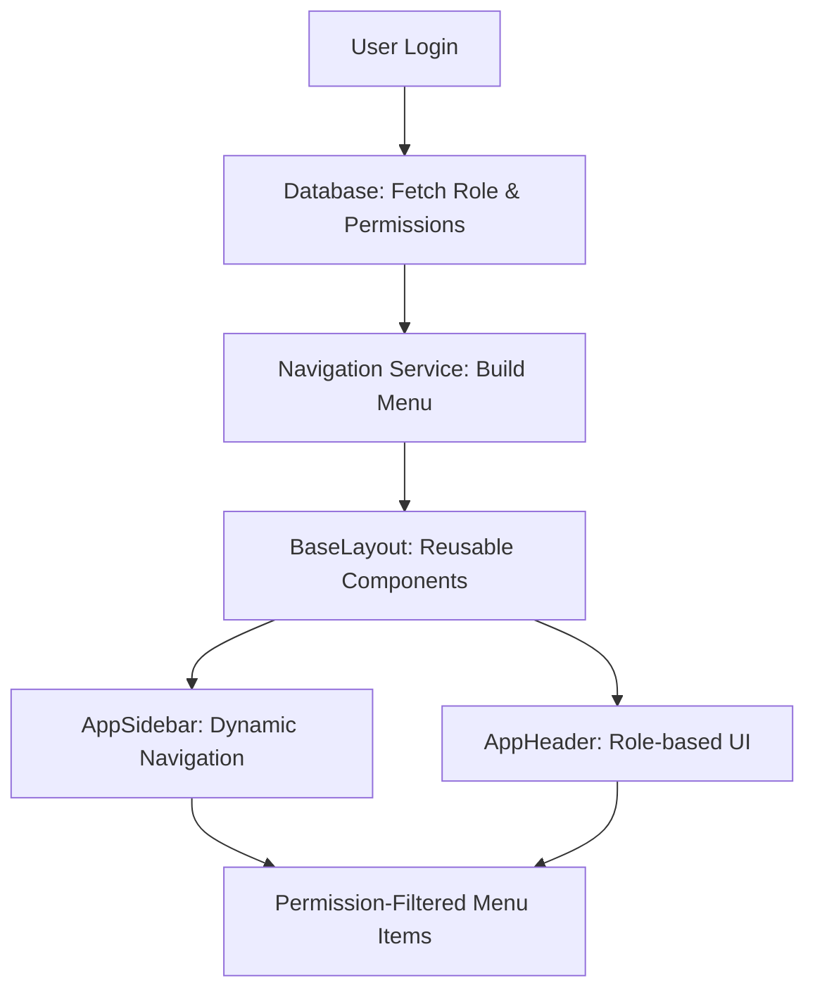
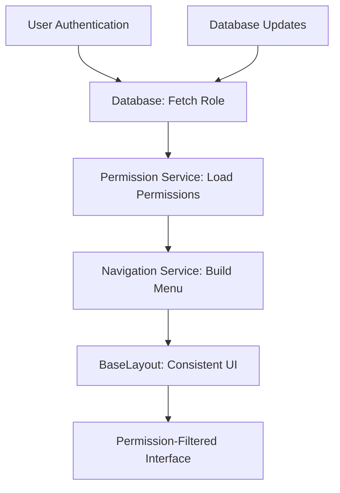

# oslo-kindergarten-vue

This template should help get you started developing with Vue 3 in Vite.

## Recommended IDE Setup

[VSCode](https://code.visualstudio.com/) + [Volar](https://marketplace.visualstudio.com/items?itemName=Vue.volar) (and disable Vetur).

## Type Support for `.vue` Imports in TS

TypeScript cannot handle type information for `.vue` imports by default, so we replace the `tsc` CLI with `vue-tsc` for type checking. In editors, we need [Volar](https://marketplace.visualstudio.com/items?itemName=Vue.volar) to make the TypeScript language service aware of `.vue` types.

## Customize configuration

See [Vite Configuration Reference](https://vite.dev/config/).

## Project Setup

```sh
npm install# Oslo Kindergarten Management System - Frontend

# Oslo Kindergarten Management System - Frontend

> A comprehensive Vue 3 application for managing kindergarten admissions and placements in Oslo Municipality with **Reusable Layout System** for consistent user experiences

[](https://vuejs.org/)
[](https://www.typescriptlang.org/)
[](https://vitejs.dev/)
[](https://tailwindcss.com/)

## 🌟 Key Innovation: Reusable Layout System

Our **Reusable Layout System** enables:
- ✅ **Consistent UI components** used everywhere (BaseLayout, AppSidebar, AppHeader)
- ✅ **Database-driven roles and permissions** (no hardcoded roles)
- ✅ **Role-based dynamic navigation** with automatic permission filtering
- ✅ **Industrial-grade performance** for large user bases (35k+ users)
- ✅ **Developer-friendly architecture** using standard Vue patterns

**🎯 Perfect for teams needing consistent, maintainable layouts!**

## 📋 Table of Contents

- [Overview](#overview)
- [🎛️ Reusable Layout System](#-reusable-layout-system)
- [Quick Start](#quick-start)
- [Development Status](#development-status)
- [Project Structure](#project-structure)
- [Development Setup](#development-setup)
- [Working with Cursor AI](#working-with-cursor-ai)
- [Key Concepts](#key-concepts)
- [Available Scripts](#available-scripts)
- [Testing](#testing)
- [Deployment](#deployment)
- [Contributing](#contributing)

## 📖 Overview

This frontend application serves multiple user roles in the Oslo kindergarten system:

- **👨‍👩‍👧‍👦 Guardians**: Submit applications, track placement status, manage child information
- **👩‍💼 Case Managers**: Process applications, manage waiting lists, create offers
- **🏫 Kindergarten Staff**: Manage capacity, track attendance, communicate with families
- **⚙️ System Administrators**: User management, system configuration, reporting

### Key Features
- 🔐 **Role-based access control** with Oslo Municipality SSO integration
- 📱 **Responsive design** optimized for desktop and mobile
- ♿ **WCAG 2.2 AA compliant** for accessibility
- 🌍 **Multi-language support** (Norwegian primary, English fallback)
- ⚡ **Real-time updates** via WebSocket connections
- 📊 **Advanced data filtering** and bulk operations
- 🎛️ **Reusable Layout System** for consistent user experience

---

## 🎛️ Reusable Layout System

Our **Reusable Layout System** provides consistent, reusable layout components with role-based dynamic navigation.

### 🚀 System Overview



### 🔧 Core Components

#### **BaseLayout** (`src/layouts/core/BaseLayout.vue`)
- ✅ Reusable layout structure for all pages
- ✅ Consistent sidebar, header, and content areas
- ✅ Theme support (light/dark) and variants (default/minimal/compact)
- ✅ Responsive design for mobile and desktop

#### **AppSidebar** (`src/layouts/components/AppSidebar.vue`)
- ✅ Same component used everywhere, dynamic navigation content
- ✅ Role-based navigation items filtered by permissions
- ✅ Collapsible design with badge support
- ✅ Theme and role-specific styling

#### **AppHeader** (`src/layouts/components/AppHeader.vue`)
- ✅ Consistent header across all pages
- ✅ User-specific content and notifications
- ✅ Theme support and responsive behavior

#### **Role & Permission Services** (`src/services/`)
- ✅ Database-driven role fetching with 5-minute caching
- ✅ Permission validation and user access control
- ✅ Mock data system for offline development
- ✅ Real-time permission updates

#### **Navigation System** (`src/layouts/composables/useNavigation.ts`)
- ✅ Dynamic navigation building based on permissions
- ✅ Badge system for notifications and counts
- ✅ Automatic permission filtering
- ✅ Category-based navigation (primary, secondary, applications)

### 📁 Layout System Architecture

```
src/layouts/
├── core/
│   └── BaseLayout.vue              # ✅ Reusable layout structure
├── components/
│   ├── AppHeader.vue               # ✅ Consistent header component
│   ├── AppSidebar.vue              # ✅ Dynamic sidebar component
│   └── AppBreadcrumb.vue           # ✅ Breadcrumb navigation
├── composables/
│   ├── useLayout.ts                # ✅ Layout state management
│   └── useNavigation.ts            # ✅ Navigation & permissions
└── types/
    └── role.types.ts               # ✅ TypeScript interfaces
```

### 🔄 Simple Usage Pattern

Every page uses the same layout components with dynamic content:

#### **Guardian Page Example**
```vue
<template>
  <BaseLayout>
    <template #content>
      <h1>Guardian Dashboard</h1>
      <!-- Sidebar shows: Dashboard, Children, Applications -->
      <!-- Header shows: Guardian-specific notifications -->
    </template>
  </BaseLayout>
</template>

<script setup lang="ts">
import BaseLayout from '@/layouts/core/BaseLayout.vue'
// Navigation automatically filtered for guardian permissions
</script>
```

#### **Case Worker Page Example**
```vue
<template>
  <BaseLayout variant="compact">
    <template #content>
      <h1>Case Worker Dashboard</h1>
      <!-- Sidebar shows: Dashboard, Review Queue, Placement Management -->
      <!-- Header shows: Case worker tools and notifications -->
    </template>
  </BaseLayout>
</template>

<script setup lang="ts">
import BaseLayout from '@/layouts/core/BaseLayout.vue'
// Navigation automatically filtered for caseworker permissions
</script>
```

#### **Admin Page Example**
```vue
<template>
  <BaseLayout variant="default">
    <template #content>
      <h1>System Administration</h1>
      <!-- Sidebar shows: Dashboard, User Management, System Config -->
      <!-- Header shows: Admin tools and system status -->
    </template>
  </BaseLayout>
</template>

<script setup lang="ts">
import BaseLayout from '@/layouts/core/BaseLayout.vue'
// Navigation automatically filtered for admin permissions
</script>
```

### 🎮 Demo System

Visit **[http://localhost:5173/demo](http://localhost:5173/demo)** to:
- ✅ View current role configuration and permissions
- ✅ See active navigation items with filtering
- ✅ Test different user roles and their navigation
- ✅ Inspect layout responsiveness and themes
- ✅ Update badge data in real-time

### 🔒 Database-Driven Permissions

All roles and permissions are fetched from the database:

```typescript
// API Endpoints Expected:
GET  /api/roles/{roleId}                    // Role details
GET  /api/roles/{roleId}/navigation         // Navigation config  
GET  /api/users/{userId}/permissions        // User permissions
PUT  /api/roles/{roleId}/navigation         // Update navigation
```

**Benefits:**
- ✅ No hardcoded roles in frontend
- ✅ Dynamic permission updates
- ✅ Super admin can modify navigation via database
- ✅ Automatic UI updates when permissions change
- ✅ Consistent layout components with dynamic content

---

## 🚀 Quick Start

### Prerequisites

- **Node.js** 18+ and **npm** 9+
- **Git** for version control
- **Cursor AI** or VS Code with Vue/TypeScript extensions

### Installation

```bash
# Clone the repository
git clone https://github.com/oslo-kommune/kindergarten-frontend.git
cd oslo-kindergarten-vue

# Install dependencies
npm install

# Copy environment configuration
cp .env.example .env.local

# Start development server
npm run dev
```

🎉 Open [http://localhost:5173](http://localhost:5173) to view the application!

**🎮 Try the Demo:** Visit [http://localhost:5173/demo](http://localhost:5173/demo) to explore the Layout System!

---

## 📊 Development Status

**Overall Progress: 75%** - **Layout System completed**, ready for team collaboration

### ✅ **COMPLETED: Layout System (100%)**

#### **Core Architecture**
- ✅ `src/types/role.types.ts` - Complete TypeScript interfaces
- ✅ `src/services/roleService.ts` - Database role fetching with caching
- ✅ `src/services/permissionService.ts` - Permission validation system
- ✅ `src/services/navigationService.ts` - Dynamic navigation building

#### **Layout Components**
- ✅ `src/layouts/core/BaseLayout.vue` - Reusable layout structure
- ✅ `src/layouts/components/AppHeader.vue` - Consistent header component
- ✅ `src/layouts/components/AppSidebar.vue` - Dynamic sidebar component
- ✅ `src/layouts/components/AppBreadcrumb.vue` - Breadcrumb navigation

#### **Composables & State Management**
- ✅ `src/layouts/composables/useLayout.ts` - Layout state management
- ✅ `src/layouts/composables/useNavigation.ts` - Navigation & permissions
- ✅ `src/stores/auth.ts` - Authentication state management

#### **Demo & Testing**
- ✅ `src/pages/demo/LayoutDemo.vue` - Comprehensive demo page
- ✅ `/demo` route for testing system capabilities
- ✅ Mock data system for offline development

### ✅ Completed Components (Ready for AI Development)

#### 1. **TypeScript Foundation (100%)**
- ✅ Complete type definitions for all domain objects
- ✅ `src/types/common.ts` - Core API and utility types
- ✅ `src/types/user.ts` - User roles, authentication, profiles
- ✅ `src/types/application.ts` - Application workflows and data
- ✅ `src/types/kindergarten.ts` - Kindergarten management types
- ✅ `src/types/role.types.ts` - **NEW: Dynamic role and permission types**

#### 2. **State Management (Pinia) (80%)**
- ✅ `src/stores/auth.ts` - Authentication state management
- ✅ `src/stores/ui.ts` - Global UI state (loading, notifications, themes)
- ✅ `src/stores/applications.ts` - Application CRUD operations
- ✅ `src/stores/kindergartens.ts` - Kindergarten data management

#### 3. **Composables Layer (85%)**
- ✅ `src/composables/auth/useAuth.ts` - Authentication integration
- ✅ `src/composables/auth/usePermissions.ts` - Role-based access control
- ✅ `src/composables/api/useApplications.ts` - Application API operations
- ✅ `src/composables/ui/useModal.ts` - Modal management system
- ✅ **NEW: `src/layouts/composables/` - Layout and navigation composables**

#### 4. **Layout System (100%)** ⭐ **NEW**
- ✅ `src/layouts/core/BaseLayout.vue` - Reusable layout system
- ✅ `src/layouts/components/` - Header, sidebar, breadcrumb components
- ✅ `src/services/` - Role, permission, and navigation services

#### 5. **API Service Layer (60%)**
- ✅ `src/services/api/base.ts` - HTTP client with interceptors
- ✅ **NEW: `src/services/roleService.ts` - Database role management**
- ✅ **NEW: `src/services/permissionService.ts` - Permission validation**
- ✅ **NEW: `src/services/navigationService.ts` - Dynamic navigation**
- ✅ Error handling and response transformation
- ✅ Authentication token management
- ✅ File upload/download utilities

### 🚧 Missing Components (AI Development Targets)

#### **Priority: High - Business Logic**
```typescript
// Missing API composables:
src/composables/api/
├── useOffers.ts           // Offer management operations
├── useWaitingList.ts      // Waiting list operations  
├── useKindergartens.ts    // Kindergarten data access
└── useUsers.ts            // User management

// Missing base components:
src/components/base/
├── BaseInput.vue          // Form input component
├── BaseSelect.vue         // Dropdown select component
├── BaseTable.vue          // Data table component
├── BaseCard.vue           // Content card component
└── BaseAlert.vue          // Alert/notification component
```

#### **Priority: Medium - Forms & Data Display**
```vue
// Missing form components:
src/components/forms/
├── ApplicationForm.vue    // Main kindergarten application form
├── OfferForm.vue          // Placement offer form
└── FormField.vue          // Generic form field wrapper

// Missing data components:
src/components/data/
├── ApplicationList.vue    // Applications listing with filters
├── WaitingList.vue        // Waiting list display
├── CapacityOverview.vue   // Kindergarten capacity view
└── DashboardMetrics.vue   // KPI dashboard widgets
```

#### **Priority: High - Page Components**
```vue
src/pages/
├── auth/ - Authentication pages
├── guardian/ - Guardian user interfaces  
├── case-manager/ - Case manager workflows
├── kindergarten/ - Kindergarten staff tools
└── admin/ - System administration
```

---

## 📁 Project Structure

```
oslo-kindergarten-vue/
├── 📄 README.md                    # This comprehensive guide
├── 📄 package.json                 # Dependencies and scripts
├── 📄 vite.config.js               # Vite build configuration
├── 📄 tsconfig.json                # TypeScript configuration
├── 📄 tailwind.config.js           # Tailwind CSS configuration
├── 📄 .eslintrc.js                 # ESLint code quality rules
├── 📄 .prettierrc                  # Code formatting rules
├── 📄 .env.example                 # Environment variables template
├── 📄 .gitignore                   # Git ignore patterns
│
├── 📂 public/                      # Static assets (served directly)
│   ├── favicon.ico                 # Browser tab icon
│   ├── manifest.json               # PWA configuration
│   └── robots.txt                  # Search engine instructions
│
├── 📂 src/                         # Main application source code
│   ├── 📄 main.js                  # Application entry point
│   ├── 📄 App.vue                  # Root Vue component
│   │
│   ├── 📂 layouts/                 # ✅ **LAYOUT SYSTEM**
│   │   ├── 📂 core/                # Core layout components
│   │   │   └── BaseLayout.vue      # ✅ Reusable layout structure
│   │   ├── 📂 components/          # Layout sub-components
│   │   │   ├── AppHeader.vue       # ✅ Consistent header component
│   │   │   ├── AppSidebar.vue      # ✅ Dynamic sidebar component
│   │   │   └── AppBreadcrumb.vue   # ✅ Breadcrumb navigation
│   │   ├── 📂 composables/         # Layout composables
│   │   │   ├── useLayout.ts        # ✅ Layout state management
│   │   │   └── useNavigation.ts    # ✅ Navigation & permissions
│   │   ├── 📂 types/               # Layout type definitions
│   │   │   └── role.types.ts       # ✅ Role/permission interfaces
│   │   └── 📄 README.md            # ✅ Layout system documentation
│   │
│   ├── 📂 services/                # ✅ **DATABASE SERVICES**
│   │   ├── roleService.ts          # ✅ Database role management
│   │   ├── permissionService.ts    # ✅ Permission validation
│   │   ├── navigationService.ts    # ✅ Dynamic navigation building
│   │   └── 📂 api/                 # REST API services
│   │       ├── base.js             # ✅ Base HTTP client
│   │       ├── auth.js             # 🚧 Authentication API
│   │       ├── applications.js     # 🚧 Application endpoints
│   │       ├── offers.js           # 🚧 Offer endpoints
│   │       ├── kindergartens.js    # 🚧 Kindergarten endpoints
│   │       └── users.js            # 🚧 User management API
│   │
│   ├── 📂 pages/                   # Route components (views)
│   │   ├── 📂 demo/                # ✅ **DEMO SYSTEM**
│   │   │   └── LayoutDemo.vue      # ✅ Layout system demo
│   │   ├── 📂 auth/                # Authentication pages
│   │   │   ├── LoginPage.vue       # 🚧 Login/OIDC redirect
│   │   │   └── CallbackPage.vue    # 🚧 OIDC callback handler
│   │   ├── 📂 guardian/            # Guardian-specific pages
│   │   ├── 📂 case-manager/        # Case manager pages
│   │   ├── 📂 kindergarten/        # Kindergarten staff pages
│   │   └── 📂 admin/               # System admin pages
│   │
│   ├── 📂 components/              # Reusable Vue components
│   │   ├── 📂 base/                # Foundation UI components
│   │   │   ├── BaseButton.vue      # ✅ Oslo design system button
│   │   │   ├── BaseModal.vue       # ✅ Modal dialog component
│   │   │   ├── BaseInput.vue       # 🚧 Form input component
│   │   │   ├── BaseTable.vue       # 🚧 Data table component
│   │   │   └── BaseCard.vue        # 🚧 Content card component
│   │   ├── 📂 forms/               # Form-specific components
│   │   ├── 📂 data/                # Data display components
│   │   └── 📂 navigation/          # Navigation components
│   │
│   ├── 📂 composables/             # Vue 3 Composition API logic
│   │   ├── 📂 auth/                # Authentication composables
│   │   │   ├── useAuth.js          # ✅ Authentication state & methods
│   │   │   └── usePermissions.js   # ✅ Role-based permission checks
│   │   ├── 📂 api/                 # API interaction composables
│   │   │   └── useApplications.js  # ✅ Application CRUD operations
│   │   └── 📂 ui/                  # UI state composables
│   │       └── useModal.js         # ✅ Modal state management
│   │
│   ├── 📂 stores/                  # Pinia state management
│   │   ├── auth.js                 # ✅ Authentication state
│   │   ├── applications.js         # ✅ Application state
│   │   ├── kindergartens.js        # ✅ Kindergarten data
│   │   └── ui.js                   # ✅ UI state (modals, loading)
│   │
│   ├── 📂 types/                   # TypeScript type definitions
│   │   ├── common.ts               # ✅ Shared utility types
│   │   ├── user.ts                 # ✅ User and role types
│   │   ├── application.ts          # ✅ Application data types
│   │   ├── kindergarten.ts         # ✅ Kindergarten types
│   │   └── role.types.ts           # ✅ **NEW: Dynamic role types**
│   │
│   ├── 📂 router/                  # Router configuration
│   │   ├── index.js                # ✅ Main router setup
│   │   ├── guards.js               # ✅ Route guard definitions
│   │   └── 📂 routes/              # Route definitions by module
│   │       ├── auth.js             # ✅ Authentication routes
│   │       ├── guardian.js         # ✅ Guardian routes
│   │       ├── caseManager.js      # ✅ Case manager routes
│   │       ├── kindergarten.js     # ✅ Kindergarten routes
│   │       ├── admin.js            # ✅ Admin routes
│   │       └── demo.js             # ✅ **NEW: Demo routes**
│   │
│   └── 📂 locales/                 # Internationalization files
│       ├── no.json                 # ✅ Norwegian translations (primary)
│       └── en.json                 # ✅ English translations (fallback)
│
├── 📂 tests/                       # Test suites
└── 📂 docs/                        # Project documentation
```

**Legend:**
- ✅ **Complete** - Ready for production
- 🚧 **Missing** - Target for AI development
- ⭐ **New** - Recently implemented features

---

## 🛠️ Development Setup

### Environment Variables

Create `.env.local` from the template and configure:

```bash
# API Configuration
VITE_API_BASE_URL=http://localhost:8080/api
VITE_WS_URL=ws://localhost:8080/ws

# Authentication (Oslo Municipality OIDC)
VITE_OIDC_AUTHORITY=https://login.oslo.kommune.no
VITE_OIDC_CLIENT_ID=kindergarten-frontend-dev
VITE_OIDC_REDIRECT_URI=http://localhost:5173/auth/callback

# Feature Flags
VITE_ENABLE_REAL_TIME=true
VITE_ENABLE_ANALYTICS=false

# Development Settings
VITE_LOG_LEVEL=debug
VITE_MOCK_API=false

# Layout System
VITE_LAYOUT_DEMO_MODE=true
VITE_MOCK_PERMISSIONS=true
```

### IDE Setup (Cursor AI)

**Recommended Cursor AI Settings:**

1. **Enable TypeScript**: Cursor will provide better autocomplete and error detection
2. **Install Vue Language Features**: Ensures proper Vue 3 Composition API support
3. **Configure AI Context**: Add these patterns to your `.cursorignore`:
   ```
   node_modules/
   dist/
   coverage/
   *.log
   .env.local
   ```

**Essential Cursor AI Prompts for this project:**

```bash
# Component with Layout Integration
"Create a [ComponentName] that uses BaseLayout and implements role-based functionality"

# Service Development
"Create a [ServiceName] following our roleService pattern with caching, mock data, and TypeScript interfaces"

# Navigation Integration
"Add navigation items for [feature] that integrate with our dynamic navigation system and include proper permissions"

# Permission Testing
"Generate tests for permission-based components using our mock permission data"

# Page Development
"Create a page that uses BaseLayout with proper navigation integration and permission checks"
```

---

## 🧠 Working with Cursor AI

### Project Context for AI

When working with Cursor AI, provide this context for better assistance:

1. **Architecture**: "This is a Vue 3 Composition API project with TypeScript, Pinia for state management, and our custom Reusable Layout System with database-driven roles"

2. **Domain**: "Oslo Municipality kindergarten admission system with Guardian, Case Manager, Kindergarten Staff, and Admin roles using our consistent layout components"

3. **Patterns**: "Follow the established patterns in composables/, use our Reusable Layout System for new components, ensure consistent BaseLayout usage, and maintain WCAG 2.2 AA compliance"

### AI Development Strategy

#### **Layout Component Development**
**AI Prompt Example:**
```
"Create a page component that uses our BaseLayout with role-based navigation. Include proper TypeScript interfaces from src/types/role.types.ts, integrate with useNavigation composable for permission checking, and follow our established design patterns for consistent UI."
```

#### **Permission-Based Development**
**AI Prompt Example:**
```
"Create ApplicationForm.vue that uses our permission system. Check 'create:application' permission using useNavigation, integrate with our BaseLayout, and follow the established service patterns for API calls. Include role-based field visibility."
```

#### **Service Integration**
**AI Prompt Example:**
```
"Create a new service following our pattern in src/services/. Include 5-minute caching like roleService, mock data for development, proper TypeScript interfaces, and integration with our permission system."
```

### Common AI Prompts for Our System

```bash
# Component with Layout Integration
"Create a [ComponentName] that uses BaseLayout and implements role-based functionality"

# Service Development
"Create a [ServiceName] following our roleService pattern with caching, mock data, and TypeScript interfaces"

# Navigation Integration
"Add navigation items for [feature] that integrate with our dynamic navigation system and include proper permissions"

# Permission Testing
"Generate tests for permission-based components using our mock permission data"

# Page Development
"Create a page that uses BaseLayout with proper navigation integration and permission checks"
```

---

## 🔑 Key Concepts

### Reusable Layout Architecture


### Simple Component Usage
```
Any Page → BaseLayout → Automatic Navigation + Header → Consistent UI
```

### Permission-Based Navigation
```
User → Role → Permissions → Navigation Filtering → UI Rendering
```

### Role-Based Access
- **Database Level**: Roles and permissions stored in database
- **Service Level**: Caching and validation in services
- **Component Level**: Permission-based rendering
- **Navigation Level**: Dynamic menu building

### Design System

The Oslo Municipality design system is implemented via Tailwind CSS classes:

```css
/* Oslo Brand Colors */
.bg-oslo-50        /* Light blue backgrounds */
.bg-oslo-600       /* Primary blue buttons */
.text-oslo-900     /* Dark blue text */

/* Component Classes */
.rounded-oslo      /* Oslo border radius (0.375rem) */
.shadow-oslo       /* Oslo shadow style */
.btn-primary       /* Oslo-styled buttons */

/* Accessibility */
.sr-only           /* Screen reader only */
.focus:ring-oslo   /* Focus indicators */
```

---

## 📜 Available Scripts

### Development
```bash
npm run dev              # Start development server (http://localhost:5173)
npm run dev:host         # Expose dev server to network
npm run dev:debug        # Start with debugging enabled
```

### Building
```bash
npm run build            # Production build
npm run build:staging    # Staging build with source maps
npm run preview          # Preview production build locally
```

### Code Quality
```bash
npm run lint             # Run ESLint
npm run lint:fix         # Fix ESLint issues automatically
npm run format           # Format code with Prettier
npm run type-check       # TypeScript type checking
```

### Testing
```bash
npm run test             # Run unit tests
npm run test:watch       # Run tests in watch mode
npm run test:ui          # Open Vitest UI
npm run test:coverage    # Generate coverage report
npm run test:e2e         # Run Cypress E2E tests
npm run test:e2e:dev     # Open Cypress in development mode
```

### Layout System Testing
```bash
# Visit these URLs for testing our Layout System:
# http://localhost:5173/demo                    # Layout system demo
# http://localhost:5173/demo?role=guardian      # Test guardian permissions
# http://localhost:5173/demo?role=caseworker    # Test caseworker permissions
```

### Maintenance
```bash
npm run clean            # Clean build artifacts
npm run deps:update      # Update dependencies
npm run security:audit   # Security vulnerability check
```

---

## 🧪 Testing

### Test Structure
```
tests/
├── unit/
│   ├── components/      # Component tests
│   ├── composables/     # Composable tests
│   ├── services/        # Service layer tests
│   ├── layouts/         # Layout System tests
│   └── utils/           # Utility function tests
├── integration/
│   └── workflows/       # User workflow tests
└── e2e/
    ├── guardian/        # Guardian user journeys
    ├── case-manager/    # Case manager workflows
    ├── admin/           # Admin functionality
    └── layouts/         # Layout system E2E tests
```

### Testing the Layout System

```bash
# Unit tests for layout components
npm run test -- --grep "layout"

# Test permission services
npm run test -- --grep "permission"

# E2E tests for role-based access
npm run test:e2e -- --spec "**/role-access.cy.js"
```

### Test Examples

**Layout Test:**
```javascript
// tests/unit/layouts/BaseLayout.test.js
import BaseLayout from '@/layouts/core/BaseLayout.vue'

test('renders layout with all sections', () => {
  const wrapper = mount(BaseLayout)
  expect(wrapper.find('.app-sidebar')).toBeTruthy()
  expect(wrapper.find('.app-header')).toBeTruthy()
  expect(wrapper.find('.app-content')).toBeTruthy()
})
```

**Permission Test:**
```javascript
// tests/unit/composables/useNavigation.test.js
import { useNavigation } from '@/layouts/composables/useNavigation'

test('filters navigation based on user permissions', async () => {
  const navigation = useNavigation()
  await navigation.loadNavigation()
  
  expect(navigation.primaryNavigation.value).toHaveLength(3)
  expect(navigation.primaryNavigation.value[0].id).toBe('dashboard')
})
```

---

## 🚀 Deployment

### Production Build
```bash
# Create optimized production build
npm run build

# Preview production build locally
npm run preview
```

### Docker Deployment
```bash
# Build container image
docker build -t kindergarten-frontend .

# Run container
docker run -p 80:80 kindergarten-frontend
```

### Environment-Specific Builds
- **Development**: `npm run dev` - Hot reload, debug tools, mock data
- **Staging**: `npm run build:staging` - Source maps, error tracking
- **Production**: `npm run build` - Optimized, minified, real API

---

## 🤝 Contributing

### Development Workflow

1. **Create Feature Branch**
   ```bash
   git checkout -b feature/new-page-component
   ```

2. **Follow Code Standards**
   - Use TypeScript for all new code
   - Follow Vue 3 Composition API patterns
   - Use BaseLayout for all pages
   - Integrate with navigation system
   - Ensure WCAG 2.2 AA compliance
   - Add comprehensive tests

3. **Pre-commit Checks**
   ```bash
   npm run lint          # ESLint validation
   npm run type-check    # TypeScript validation
   npm run test          # Unit test validation
   ```

4. **Pull Request Checklist**
   - [ ] Tests pass (`npm run test`)
   - [ ] No linting errors (`npm run lint`)
   - [ ] TypeScript compiles (`npm run type-check`)
   - [ ] BaseLayout integration tested
   - [ ] Permission checks implemented
   - [ ] Accessibility tested
   - [ ] Mobile responsive
   - [ ] Norwegian translations added
   - [ ] Documentation updated

### Code Style Guidelines

**Component Naming:**
- PascalCase for components: `ApplicationForm.vue`
- kebab-case for files: `application-form.vue`
- Descriptive, domain-specific names

**Layout Integration:**
- Use BaseLayout for all pages
- Use `useNavigation` for permission checks
- Follow established service patterns
- Include proper TypeScript interfaces

**TypeScript Usage:**
- Define interfaces for all props and emits
- Use strict type checking
- Import types from `src/types/role.types.ts`
- Avoid `any` type, prefer `unknown`

---

## 📚 Additional Resources

### Documentation
- [Vue 3 Documentation](https://vuejs.org/guide/)
- [TypeScript Vue Guide](https://vuejs.org/guide/typescript/overview.html)
- [Pinia State Management](https://pinia.vuejs.org/)
- [Oslo Design System](https://designsystem.oslo.kommune.no/)
- **[Layout System Documentation](./src/layouts/README.md)** - Our layout system documentation

### Tools & Extensions
- [Vue DevTools](https://devtools.vuejs.org/) - Browser extension for debugging
- [Cursor AI Documentation](https://cursor.sh/docs) - AI-powered development

### Oslo Municipality Resources
- [Design Manual](https://designmanual.oslo.kommune.no/)
- [API Documentation](./docs/api-integration.md)
- [Accessibility Guidelines](https://www.uutilsynet.no/english/web-accessibility-directive-wad/252)

---

## 🆘 Getting Help

### For New Developers
1. Review this README thoroughly
2. Check out the **[Layout System documentation](./src/layouts/README.md)**
3. Visit **[http://localhost:5173/demo](http://localhost:5173/demo)** to explore the system
4. Set up the development environment
5. Run the test suite to ensure everything works
6. Start with small components using BaseLayout

### For Team Component Integration
1. Study the BaseLayout usage pattern
2. Review existing components in `src/layouts/components/`
3. Use the demo page to test your components
4. Follow the integration steps in the Layout documentation

### For Cursor AI Users
1. Provide context about the Oslo kindergarten domain
2. Reference our Reusable Layout System architecture
3. Ask for BaseLayout integration
4. Request TypeScript compliance with our role.types.ts
5. Ask for Norwegian translations for user-facing text

### Support Channels
- **Technical Issues**: Create GitHub issue with reproduction steps
- **Layout System Questions**: Review `src/layouts/README.md`
- **Oslo Municipality Specific**: Contact IST development team
- **Architecture Questions**: Review `/docs` folder or ask senior developers

---

## 🏆 Project Goals

This frontend application aims to:

1. **Streamline Admissions**: Reduce manual work for case managers through automation
2. **Improve User Experience**: Intuitive interfaces for all user types
3. **Enable Consistent Design**: Reusable layout components for maintainable UI
4. **Ensure Database-Driven Flexibility**: No hardcoded roles, all configuration via database
5. **Ensure Accessibility**: WCAG 2.2 AA compliance for inclusive design
6. **Maintain Security**: Protect sensitive child and family data with robust permission system
7. **Enable Scalability**: Support Oslo's 35,000+ kindergarten places
8. **Facilitate Real-time Updates**: Dynamic permission and navigation updates

---

**🎉 Happy Coding with our Reusable Layout System!**

For questions about this project, please refer to:
- **General documentation**: `/docs` folder
- **Layout System**: `src/layouts/README.md`
- **Demo system**: [http://localhost:5173/demo](http://localhost:5173/demo)
- **Development team**: IST Oslo Municipality

### Compile and Hot-Reload for Development

```sh
npm run dev
```

### Type-Check, Compile and Minify for Production

```sh
npm run build
```

### Lint with [ESLint](https://eslint.org/)

```sh
npm run lint
```
